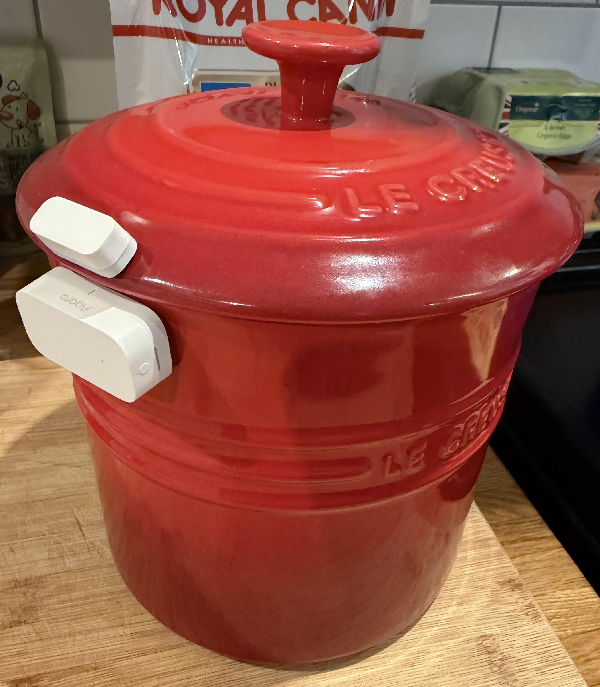

# 🛠️ PuppyOS Hardware Guide

PuppyOS does not require special PuppyOS hardware.

It uses ordinary sensors and devices that Home Assistant can already see.

The basic principle is:

> **If Home Assistant can detect it, PuppyOS can probably use it.**

This page explains the hardware used in the original PuppyOS setup and what you actually need to get started.

---

# ⭐ The Minimum Hardware

For the core PuppyOS features you need:

| Hardware | What PuppyOS Uses It For | Required? |
|---|---|---|
| Home Assistant | Runs PuppyOS | ✅ Yes |
| Food container contact sensor | Automatic feeding detection | ✅ Recommended |
| Garden access door sensor | Outside / toilet tracking | ✅ Recommended |
| Garden gate sensor | Gate safety warning | Optional |
| Smart speaker | Spoken warnings and reminders | Optional |
| Camera | Puppy camera dashboard | Optional |

You do **not** need to buy everything at once.

A perfectly useful PuppyOS installation can begin with **one contact sensor on the food container**.

---

# 🍽️ Food Container Sensor

This is the little trick at the heart of PuppyOS.

Instead of asking somebody to remember to press a button after feeding the puppy, PuppyOS detects the action that already happens:

```text
Open food container
        ↓
Contact sensor changes state
        ↓
Home Assistant detects it
        ↓
PuppyOS records the meal
```

The food container itself effectively becomes a giant smart-home button.

## What We Used

The original PuppyOS installation uses a small **Aqara Door & Window Sensor**.

Its compact size makes this style of sensor particularly convenient for attaching to a food container and lid.

🇬🇧 **UK Amazon:** [View the Aqara sensor on Amazon](https://link.amazon/B0j8tTizM)

> **Affiliate disclosure:** The Amazon link above is an affiliate link. If you purchase through it, the PuppyOS project may receive a small commission at no additional cost to you.

### Important Compatibility Note

PuppyOS does **not** require an Aqara sensor.

All PuppyOS needs is a contact sensor that appears in Home Assistant as a `binary_sensor`.

Depending on the exact Aqara model and your smart-home setup, you may require additional compatible hardware such as an Aqara hub, Zigbee coordinator, Matter controller or Thread Border Router.

**Check the requirements of the exact sensor you are buying before ordering it.**

If you already have another Home Assistant-compatible contact sensor, try that first.

---

# 📸 What the Food Sensor Looks Like

This is an example of a contact sensor fitted to the puppy food container:



The important part is positioning the two pieces so that:

```text
Container CLOSED
→ Sensor reports CLOSED

Container OPEN
→ Sensor reports OPEN
```

Before creating any PuppyOS automations, open Home Assistant and verify that the entity changes state reliably when you open and close the food container.

---

# 🚪 Garden Access Door Sensor

PuppyOS can use another contact sensor on the door the puppy uses to access the garden.

For example:

```text
Back door opens
→ Puppy has access outside

Back door closes
→ PuppyOS records the time
→ Toilet reminder clock begins
```

You can use another Aqara sensor or **any suitable Home Assistant-compatible contact sensor**.

The public PuppyOS YAML uses the example entity:

```yaml
binary_sensor.your_back_door_contact
```

You replace that with your own entity ID.

---

# ⚠️ Garden / Side Gate Sensor

For the PuppyOS gate safety feature, fit a contact sensor to the gate that could allow the puppy to leave the secure garden.

PuppyOS can then combine the gate and garden-door states:

```text
Garden gate OPEN
       +
Back door OPENS
       ↓
WARNING
```

The warning can be announced through a Home Assistant-compatible speaker.

This is an **additional safety layer only**.

Never rely solely on a smart-home sensor or automation to keep a puppy contained.

Physically check gates and fencing.

---

# 🔊 Smart Speaker

A smart speaker is optional, but it makes PuppyOS considerably more useful in a shared household.

It can provide spoken warnings such as:

```text
The puppy has already been fed.
Please don't feed them again yet.
```

or:

```text
The puppy needs feeding.
```

or:

```text
Warning. The garden gate is open.
Please close the gate before letting the puppy outside.
```

PuppyOS can work with a Home Assistant-supported media player and an appropriate TTS service.

Possible devices include:

- Google / Nest speakers
- Sonos speakers
- Other Home Assistant-compatible media players

You will need to replace the example entity:

```yaml
media_player.your_speaker
```

with your own media player entity.

A speaker is **not required** for the underlying tracking automations.

---

# 📹 Puppy Camera

A camera is completely optional.

If you already have a Home Assistant-compatible camera, it can be displayed on the PuppyOS dashboard.

The public dashboard uses a placeholder such as:

```yaml
camera.your_puppy_camera
```

Replace this with your own camera entity.

PuppyOS does not require a particular camera brand.

For privacy and security reasons, never publish your real camera URLs, credentials or access tokens in a public GitHub repository.

---

# ⚖️ Puppy Scales

You do **not** need smart scales.

PuppyOS currently uses a Home Assistant Number Helper to store the puppy's weight.

That means you can simply:

1. Weigh your puppy
2. Enter the new weight into Home Assistant
3. Update the Last Weighed date

Home Assistant can retain the weight history, allowing the dashboard to display growth over time.

For a very small puppy, ordinary household or pet scales may be suitable.

As the puppy grows, the weighing method will obviously need to grow with them.

---

# 📡 Zigbee, Matter, Thread... What?!

If you're new to smart homes, don't panic.

PuppyOS does not care which wireless technology your sensor uses.

It cares whether **Home Assistant can see the sensor**.

A contact sensor might communicate using:

- Zigbee
- Matter
- Thread
- Wi-Fi
- Z-Wave
- Another supported integration

The important result is an entity that looks something like:

```text
binary_sensor.food_container
```

and changes between open and closed.

If that works, PuppyOS has something it can use.

---

# 🧪 Test Before Installing PuppyOS

Before copying any automation YAML, test each physical sensor in Home Assistant.

For the food container:

```text
Close container
→ Home Assistant says CLOSED

Open container
→ Home Assistant says OPEN
```

For the garden door:

```text
Close door
→ CLOSED

Open door
→ OPEN
```

For the gate:

```text
Close gate
→ CLOSED

Open gate
→ OPEN
```

Do this **before** debugging PuppyOS.

There is little point spending an hour investigating an automation only to discover the sensor battery tab is still fitted.

---

# 🔋 Batteries Matter

Battery-powered sensors are wonderfully convenient.

They can also quietly stop reporting when their battery runs out.

For anything important, periodically check:

- Battery level
- Last communication time
- Sensor state
- Physical attachment
- Magnet alignment

For safety-related sensors such as a garden gate, physically test the system regularly.

---

# 🧲 Mounting Contact Sensors

Most contact sensors contain:

1. The main sensor
2. A smaller magnet

When the two parts are close together, the sensor normally reports closed.

When they separate, it reports open.

For a food container, one part can be attached to the body and the other to the lid.

Before using permanent adhesive:

1. Hold the sensor in the intended position
2. Open and close the container
3. Watch the entity in Home Assistant
4. Confirm reliable detection
5. Only then stick everything down

This avoids discovering that your beautifully mounted sensor misses the magnet by 3 mm.

---

# 💰 You Probably Don't Need to Buy Much

If you already use Home Assistant, check what hardware you have before buying anything.

An unused contact sensor in a drawer may be perfectly adequate.

PuppyOS is deliberately designed around inexpensive, simple sensors rather than specialist pet technology.

The clever part isn't the sensor.

It's what Home Assistant does with the information.

---

# 🐾 Original PuppyOS Hardware Philosophy

The original system grew from one very simple idea:

> **Don't change the human behaviour if you can detect the behaviour that's already happening.**

Nobody should need to remember:

```text
Feed puppy
↓
Find phone
↓
Open app
↓
Find dashboard
↓
Press "Fed"
```

Instead:

```text
Open food container
↓
Feed puppy
↓
Done
```

The house handles the boring bit.

---

# 🔐 Privacy & Security

Before sharing your own PuppyOS setup publicly, remove or obscure:

- Camera URLs
- Camera credentials
- Home Assistant URLs
- IP addresses
- Home addresses
- Wi-Fi details
- Device identifiers you consider sensitive
- Security system entities
- Access tokens

Screenshots deserve the same attention.

A pretty dashboard screenshot can accidentally reveal far more than you intended.

---

# ⚠️ Safety Notice

PuppyOS hardware and automations are convenience and reminder tools.

They are not substitutes for:

- Responsible supervision
- Secure gates and fencing
- Veterinary advice
- Appropriate feeding guidance
- Physical safety checks

Sensors can fail.

Batteries can run flat.

Automations can stop.

Networks can go offline.

For anything affecting your puppy's health or physical safety, **the human remains the final sensor**.

---

## 🐾 PuppyOS

**Simple sensors. Useful information. Less remembering.**
